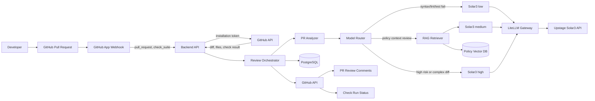
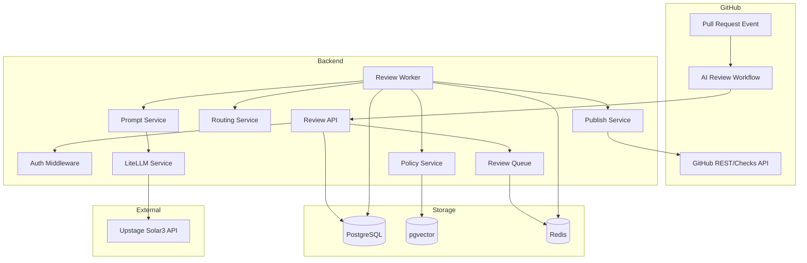
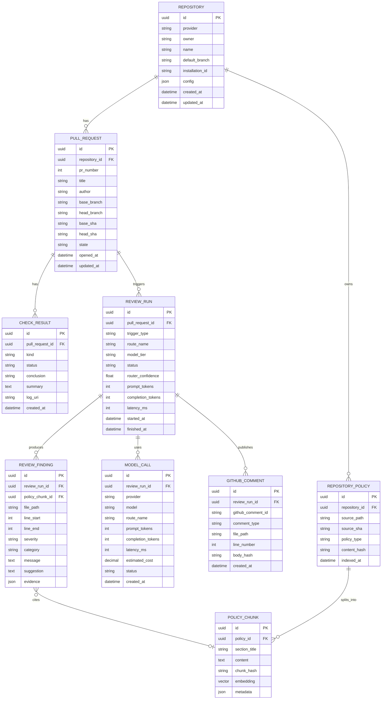
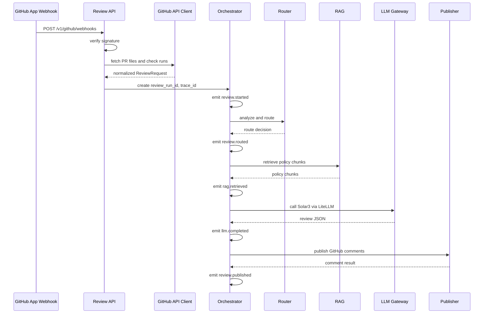

# AI 코드 리뷰 에이전트 기술 설계서

## 1. 개요

AI 코드 리뷰 에이전트는 GitHub Pull Request와 check 이벤트를 GitHub App Webhook으로 수신하고, 변경사항, 테스트 결과, 저장소 정책을 분석한 뒤 적절한 Upstage Solar3 모델 티어로 리뷰를 생성하는 서비스다. Backend API는 webhook 검증, GitHub API 수집, 라우팅, RAG, LLM 호출, GitHub 댓글 작성을 담당한다.

## 2. 설계 목표

| 구분 | 목표 |
| --- | --- |
| 비용 효율 | 모든 PR에 고성능 모델을 호출하지 않고 상황별로 low/medium/high 경로를 선택한다. |
| 저장소 맥락 반영 | RAG를 통해 팀 규칙, 문서, 컨벤션을 리뷰에 반영한다. |
| GitHub 친화성 | 개발자가 기존 PR 흐름 안에서 리뷰 결과를 확인하게 한다. |
| 재현 가능성 | review_run, routing decision, model_call, finding을 저장해 평가 가능하게 만든다. |
| 안전성 | 자동 수정, 자동 승인, 자동 병합은 MVP 범위에서 제외한다. |

## 3. 시스템 아키텍처



### 주요 컴포넌트

| 컴포넌트 | 책임 |
| --- | --- |
| GitHub App Webhook | PR/check 이벤트 전달, repository 설치 단위 권한 제공 |
| Backend API | webhook signature 검증, 리뷰 작업 등록, 내부 실행 API 제공 |
| GitHub API Client | installation token 발급, PR diff/files/check 결과 수집 |
| Review Orchestrator | LangGraph workflow 실행과 예외 처리 |
| LangGraph Workflow | 분석, 라우팅, RAG, LLM 호출, 저장, 게시 node를 그래프로 연결 |
| PR Analyzer | diff 크기, 파일 유형, 테스트 실패, 위험도 feature 계산 |
| Model Router | low/medium/high 라우트 결정 |
| Policy Indexer | 저장소 정책 문서를 chunking하고 embedding 저장 |
| RAG Retriever | PR 변경사항과 관련된 정책 chunk 검색 |
| Prompt Builder | route별 입력 프롬프트와 출력 schema 구성 |
| LiteLLM Gateway | Upstage Solar3 API 호출 추상화 |
| Response Validator | LLM 응답 schema, 라인 번호, 중복 finding 검증 |
| GitHub Publisher | PR comment, inline review comment, check run 작성 |
| Persistence Layer | review_run, finding, model_call, policy_chunk 저장 |

## 4. 서비스 아키텍처



### 서비스 경계

| 서비스 | 설명 |
| --- | --- |
| Review API | GitHub App webhook과 내부 리뷰 실행 요청을 받는 API |
| Review Worker | LangGraph workflow로 긴 LLM 호출과 RAG 검색을 비동기로 처리하는 worker |
| Policy Service | 저장소 정책 문서 indexing, 검색, 버전 관리 담당 |
| Routing Service | test/lint 상태와 위험도 feature를 기반으로 모델 티어 결정 |
| LLM Service | LiteLLM을 통해 Solar3 API 호출, 재시도, 사용량 기록 |
| Publish Service | GitHub API를 통해 comment/check run을 작성 |

### LangGraph Workflow Node

리뷰 실행은 LangGraph `StateGraph`로 구성한다.

```text
create_review
 -> extract_features
 -> select_route
 -> retrieve_policies 또는 skip_policy_retrieval
 -> build_prompt
 -> call_llm
 -> assemble_result
 -> persist_result
 -> publish_comment
 -> complete_review
```

`select_route` 이후에는 route의 `use_rag` 값에 따라 policy retrieval node로 분기한다.
각 node는 SSE event를 발행하므로 UI 또는 로그에서 review_run 단위 실행 단계를 추적할 수 있다.

## 5. 라우팅 설계

### 라우팅 입력

| 필드 | 예시 | 설명 |
| --- | --- | --- |
| `syntax_status` | `passed`, `failed`, `unknown` | 파싱 또는 컴파일 가능 여부 |
| `lint_status` | `passed`, `failed`, `skipped` | lint 결과 |
| `test_status` | `passed`, `failed`, `skipped` | test 결과 |
| `changed_files_count` | `8` | 변경 파일 수 |
| `changed_lines` | `320` | 추가/삭제 라인 합계 |
| `risk_files` | `["auth/service.py"]` | 고위험 경로 또는 파일 |
| `policy_available` | `true` | RAG 정책 문서 존재 여부 |
| `router_confidence` | `0.83` | 라우팅 결정 신뢰도 |

### 라우팅 규칙

| 우선순위 | 조건 | 라우트 | 모델 티어 |
| --- | --- | --- | --- |
| 1 | `syntax_status=failed` 또는 `lint_status=failed` 또는 `test_status=failed` | `simple_failure_review` | Solar3 low |
| 2 | 테스트 통과, 정책 문서 존재, 고위험 변경 아님 | `policy_context_review` | Solar3 medium |
| 3 | 인증/권한/보안/결제/DB migration/인프라 변경 포함 | `deep_quality_review` | Solar3 high |
| 4 | 변경 라인 수 또는 파일 수가 임계값 초과 | `deep_quality_review` | Solar3 high |
| 5 | 라우팅 신뢰도 낮음 | `deep_quality_review` | Solar3 high |

### 라우팅 의사코드

```python
def select_route(features: PullRequestFeatures) -> ReviewRoute:
    if features.syntax_failed or features.lint_failed or features.test_failed:
        return ReviewRoute(
            name="simple_failure_review",
            model_tier="solar3-low",
            use_rag=False,
            focus=["failure_summary", "likely_cause", "fix_priority"],
        )

    if (
        features.has_high_risk_files
        or features.changed_lines > 600
        or features.changed_files_count > 20
        or features.router_confidence < 0.65
    ):
        return ReviewRoute(
            name="deep_quality_review",
            model_tier="solar3-high",
            use_rag=True,
            focus=["architecture", "security", "performance", "maintainability"],
        )

    return ReviewRoute(
        name="policy_context_review",
        model_tier="solar3-medium",
        use_rag=True,
        focus=["repo_policy", "style", "tests", "api_contract"],
    )
```

## 6. RAG 설계

### 인덱싱 대상

| 경로 | 설명 |
| --- | --- |
| `.ai-reviewer/policies/*.md` | 팀이 직접 작성한 리뷰 정책 |
| `CONTRIBUTING.md` | 기여 규칙, PR 규칙 |
| `README.md` | 프로젝트 개요와 사용 규칙 |
| `docs/**/*.md` | 설계 문서, API 문서 |
| `CODEOWNERS` | 코드 소유자 정보 |
| `.github/pull_request_template.md` | PR 작성 규칙 |

### Chunk metadata

| 필드 | 설명 |
| --- | --- |
| `repository_id` | 저장소 ID |
| `source_path` | 원본 문서 경로 |
| `source_sha` | 인덱싱 기준 commit SHA |
| `section_title` | 문서 섹션 제목 |
| `policy_type` | style, test, api, security, architecture |
| `chunk_hash` | 중복 감지용 hash |
| `content` | chunk 원문 |
| `embedding` | vector embedding |

### 검색 전략

1. PR diff summary와 변경 파일 경로를 query로 구성한다.
2. 변경 파일 확장자와 경로를 metadata filter로 사용한다.
3. top-k 검색 후 같은 문서의 중복 chunk를 제거한다.
4. 정책 근거가 필요한 medium/high 경로에만 RAG context를 주입한다.
5. 리뷰 결과에는 `policy_source`를 포함해 어떤 정책에 근거했는지 남긴다.

## 7. 데이터베이스 ERD



## 8. API 설계

### 공통 규칙

| 항목 | 내용 |
| --- | --- |
| Base URL | `/v1` |
| 인증 | GitHub Webhook HMAC signature, 내부 API Bearer token, GitHub App installation token |
| 응답 형식 | JSON |
| 비동기 처리 | 리뷰 요청은 `202 Accepted`로 받고 worker에서 처리 |
| idempotency | `repository + pr_number + head_sha` 기준 중복 실행 방지 |

### 8.1 GitHub Webhook 수신

`POST /v1/github/webhooks`

GitHub App이 `pull_request`, `check_suite`, `check_run` 이벤트를 Backend API로 전달한다. API는 `X-Hub-Signature-256`으로 payload를 검증한 뒤 background 작업으로 넘긴다.

기본 운영 모드:

```text
GITHUB_WEBHOOK_REVIEW_MODE=after_checks
```

이 모드에서는 `pull_request` 이벤트는 수신만 하고, `check_suite.completed` 또는 `check_run.completed` 이벤트에서 GitHub API로 PR diff, 변경 파일, check 결과를 수집해 리뷰를 실행한다.

Response:

```json
{
  "status": "accepted",
  "event_name": "check_suite",
  "delivery_id": "72d3162e-cc78-11e3-81ab-4c9367dc0958",
  "review_mode": "after_checks"
}
```

### 8.2 내부 리뷰 실행 요청

`POST /v1/reviews`

GitHub App webhook adapter 또는 수동 smoke test가 정규화된 PR 정보, 테스트 결과, diff 요약을 Backend API로 전달한다.

```json
{
  "repository": {
    "provider": "github",
    "owner": "team-a",
    "name": "sample-api",
    "default_branch": "main"
  },
  "pull_request": {
    "number": 42,
    "title": "Add user profile API",
    "author": "dev-user",
    "base_sha": "abc123",
    "head_sha": "def456",
    "base_branch": "main",
    "head_branch": "feature/profile-api"
  },
  "checks": [
    {
      "kind": "test",
      "status": "completed",
      "conclusion": "passed",
      "summary": "128 passed"
    }
  ],
  "changed_files": [
    {
      "path": "app/api/profile.py",
      "status": "modified",
      "additions": 80,
      "deletions": 12,
      "patch": "@@ ..."
    }
  ],
  "github": {
    "run_id": "123456789",
    "event_name": "pull_request"
  }
}
```

Response:

```json
{
  "review_run_id": "7fa66b98-81fc-43b2-b2a1-0a9f64b20f31",
  "status": "queued",
  "estimated_route": "policy_context_review"
}
```

### 8.3 리뷰 실행 상태 조회

`GET /v1/reviews/{review_run_id}`

Response:

```json
{
  "review_run_id": "7fa66b98-81fc-43b2-b2a1-0a9f64b20f31",
  "status": "completed",
  "route_name": "policy_context_review",
  "model_tier": "solar3-medium",
  "findings_count": 4,
  "latency_ms": 42800,
  "published_comments": 3
}
```

### 8.4 저장소 정책 동기화

`POST /v1/repositories/{repository_id}/policies/sync`

저장소의 정책 문서를 다시 읽고 vector index를 갱신한다.

```json
{
  "source_sha": "def456",
  "paths": [
    ".ai-reviewer/policies/review.md",
    "CONTRIBUTING.md",
    "docs/api-style.md"
  ]
}
```

Response:

```json
{
  "repository_id": "f35c0e50-12b5-4bd5-a5f9-1253f559df51",
  "indexed_documents": 3,
  "indexed_chunks": 28,
  "status": "completed"
}
```

### 8.4 라우팅 미리보기

`POST /v1/routing/preview`

테스트용으로 PR feature를 넣고 어떤 route가 선택되는지 확인한다.

```json
{
  "syntax_status": "passed",
  "lint_status": "passed",
  "test_status": "passed",
  "changed_files_count": 6,
  "changed_lines": 180,
  "risk_files": [],
  "policy_available": true
}
```

Response:

```json
{
  "route_name": "policy_context_review",
  "model_tier": "solar3-medium",
  "use_rag": true,
  "router_confidence": 0.86,
  "reasons": [
    "tests passed",
    "repository policy is available",
    "no high-risk file detected"
  ]
}
```

### 8.5 Health check

`GET /healthz`

Response:

```json
{
  "status": "ok",
  "database": "ok",
  "queue": "ok"
}
```

## 9. GitHub App 설계

### 9.1 App 권한

| 권한 | 수준 | 용도 |
| --- | --- | --- |
| Metadata | Read | repository 기본 정보 조회 |
| Contents | Read | 정책 문서와 변경 파일 조회 |
| Pull requests | Read and write | PR 정보 조회, review/comment 작성 |
| Issues | Read and write | PR summary comment 작성 |
| Checks | Read and write | CI/check 상태 조회, AI 리뷰 check run 작성 |

### 9.2 구독 이벤트

| 이벤트 | 사용 목적 |
| --- | --- |
| `pull_request` | PR 생성, 갱신, 재오픈 감지 |
| `check_suite` | CI/check 완료 후 리뷰 실행 트리거 |
| `check_run` | check_suite 미지원 또는 세부 check 완료 fallback |
| `installation` | 앱 설치/삭제 이력 추적 |
| `installation_repositories` | 설치 repository 변경 추적 |

### 9.3 Webhook 처리 흐름

1. GitHub가 `/v1/github/webhooks`로 event payload를 전송한다.
2. API가 `X-Hub-Signature-256` HMAC signature를 검증한다.
3. `pull_request` 이벤트는 PR/head SHA를 기록하고 check 완료를 기다린다.
4. `check_suite.completed` 이벤트에서 `installation.id`로 installation token을 발급한다.
5. GitHub API로 PR files, diff patch, check runs를 수집한다.
6. 수집 데이터를 내부 `ReviewRequest`로 정규화한다.
7. 기존 Review Orchestrator가 라우팅, RAG, LLM 호출, publish를 수행한다.

### 9.4 운영 모드

```text
GITHUB_WEBHOOK_REVIEW_MODE=after_checks
```

기본 모드다. test/lint 결과를 라우팅에 반영하기 위해 check 완료 후 리뷰한다.

```text
GITHUB_WEBHOOK_REVIEW_MODE=pull_request
```

CI가 없는 데모 repository에서 PR 이벤트만으로 리뷰한다. check 상태는 `unknown`으로 처리된다.

```text
GITHUB_WEBHOOK_REVIEW_MODE=all
```

PR 이벤트와 check 완료 이벤트를 모두 처리한다. 중복 리뷰 방지를 위한 idempotency 제어가 필요하다.

## 10. 리뷰 출력 스키마

```json
{
  "summary": {
    "route_name": "policy_context_review",
    "overall_risk": "medium",
    "short_comment": "테스트는 통과했지만 API 응답 형식 정책과 다른 부분이 있습니다."
  },
  "findings": [
    {
      "severity": "medium",
      "category": "api_contract",
      "file_path": "app/api/profile.py",
      "line_start": 42,
      "line_end": 48,
      "message": "프로젝트 API 정책은 에러 응답에 code/message 필드를 요구합니다.",
      "suggestion": "예외 응답을 {\"code\": \"...\", \"message\": \"...\"} 형식으로 맞추는 것이 좋습니다.",
      "policy_source": "docs/api-style.md#Error Response",
      "confidence": 0.82
    }
  ]
}
```

## 11. 보안 및 운영 고려사항

1. LLM 호출 전 secret 패턴을 탐지해 마스킹한다.
2. GitHub token은 저장하지 않고 실행 시점의 secret 또는 installation token을 사용한다.
3. private repository 코드를 외부 LLM API로 전달한다는 점을 README와 설정에 명시한다.
4. 로그에는 원문 diff 전체를 남기지 않고 필요한 요약, hash, finding 중심으로 저장한다.
5. 모델 호출 실패 시 exponential backoff로 재시도한다.
6. 동일 head SHA에 대한 중복 리뷰 요청은 idempotency key로 제어한다.
7. PR comment를 다시 작성할 때는 기존 bot comment를 업데이트해 중복 댓글을 줄인다.

## 12. 로컬 개발 구성

```text
.
├── backend/
│   ├── app/
│   │   ├── api/
│   │   ├── services/
│   │   ├── workers/
│   │   ├── models/
│   │   └── prompts/
│   └── tests/
├── github-action/
│   └── request_ai_review.py
├── policies/
│   └── sample-review-policy.md
├── docker-compose.yml
└── README.md
```

필수 환경 변수:

```text
UPSTAGE_API_KEY=
AI_REVIEWER_TOKEN=
GITHUB_WEBHOOK_SECRET=
GITHUB_APP_ID=
GITHUB_APP_PRIVATE_KEY=
DATABASE_URL=
REDIS_URL=
```

## 13. MVP 완료 기준

1. 샘플 저장소에서 PR 생성/check 완료 시 GitHub App Webhook이 리뷰를 트리거한다.
2. test failure PR은 Solar3 low 경로로 라우팅된다.
3. test passed PR은 RAG 정책 검색 후 Solar3 medium 경로로 리뷰된다.
4. 고위험 파일 또는 대규모 diff는 Solar3 high 경로로 라우팅된다.
5. 리뷰 결과가 PR summary comment와 inline comment로 게시된다.
6. review_run, model_call, finding이 DB에 저장된다.
7. 최소 3개의 샘플 PR에 대해 라우팅 결과와 리뷰 품질을 평가할 수 있다.

## 14. LLMOps 및 Observability 고도화 설계

### 14.1 LLMOps 설계 방향

이 프로젝트의 LLMOps 목표는 모델을 호출하는 것 자체가 아니라, 리뷰 품질과 비용을 지속적으로 비교하고 개선할 수 있게 만드는 것이다. 따라서 route, prompt version, model tier, token, latency, evaluation result를 하나의 운영 데이터로 묶는다.

| 항목 | 저장 필드 | 활용 |
| --- | --- | --- |
| Prompt Version | `prompt_version`, `route_name` | 프롬프트 변경 전후 리뷰 품질 비교 |
| Model Call | `provider`, `model`, `model_tier`, `tokens`, `latency_ms` | 모델별 비용과 속도 분석 |
| Evaluation Result | `expected_route`, `actual_route`, `policy_citation_rate` | 라우팅 및 RAG 품질 평가 |
| Fallback | `retry_count`, `fallback_used`, `error_type` | LLM 실패 대응과 안정성 개선 |
| Cost | `estimated_cost`, `cost_by_route` | high 모델 호출 절감 효과 계산 |

### 14.2 Prompt Registry

route별 프롬프트는 코드에 하드코딩하지 않고 버전 관리 가능한 파일 또는 registry 형태로 분리한다.

```text
backend/app/prompts/
├── simple_failure_review.v1.md
├── policy_context_review.v1.md
└── deep_quality_review.v1.md
```

프롬프트 metadata 예시:

```json
{
  "prompt_name": "policy_context_review",
  "prompt_version": "v1",
  "route_name": "policy_context_review",
  "model_tier": "solar3-medium",
  "output_schema_version": "review-result.v1"
}
```

### 14.3 Observability 설계 방향

Observability의 핵심은 한 번의 리뷰 실행을 `review_run_id`와 `trace_id`로 추적하는 것이다. 리뷰 실행은 `analyze`, `route`, `retrieve`, `prompt_build`, `llm_call`, `validate`, `publish` 단계로 나누고, 각 단계의 latency와 성공/실패 여부를 기록한다.



### 14.4 Structured Log 이벤트

```json
{
  "event": "review.routed",
  "trace_id": "trc_123",
  "review_run_id": "run_456",
  "repository": "team-a/sample-api",
  "pr_number": 42,
  "route_name": "policy_context_review",
  "model_tier": "solar3-medium",
  "confidence": 0.86,
  "latency_ms": 18,
  "reasons": [
    "tests passed",
    "repository policy is available"
  ]
}
```

권장 이벤트:

| 이벤트 | 설명 |
| --- | --- |
| `review.started` | 리뷰 요청 수신 |
| `review.routed` | 라우팅 결과 결정 |
| `rag.retrieved` | 정책 문서 검색 완료 |
| `llm.completed` | 모델 호출 완료 |
| `llm.failed` | 모델 호출 실패 |
| `review.validated` | LLM 응답 schema 검증 완료 |
| `review.published` | GitHub 댓글 게시 완료 |
| `review.failed` | 전체 리뷰 실패 |

### 14.5 Metrics API

`GET /v1/metrics/summary`

Response:

```json
{
  "total_review_runs": 27,
  "route_counts": {
    "simple_failure_review": 9,
    "policy_context_review": 14,
    "deep_quality_review": 4
  },
  "average_latency_ms": {
    "analyze": 12,
    "retrieve": 44,
    "llm_call": 1840,
    "publish": 230
  },
  "model_usage": {
    "solar3-low": {
      "calls": 9,
      "prompt_tokens": 12000,
      "completion_tokens": 2500
    },
    "solar3-medium": {
      "calls": 14,
      "prompt_tokens": 42000,
      "completion_tokens": 7600
    },
    "solar3-high": {
      "calls": 4,
      "prompt_tokens": 26000,
      "completion_tokens": 4400
    }
  },
  "failure_rate": 0.03,
  "policy_citation_rate": 0.82
}
```

### 14.6 Cloud Run 운영 연계

Cloud Run 배포 시 structured log는 Google Cloud Logging으로 수집된다. 운영자는 `review_run_id`, `route_name`, `model_tier`, `event` 필드로 로그를 필터링하여 특정 PR 리뷰가 어느 단계에서 느려졌거나 실패했는지 확인할 수 있다.

예시 필터:

```text
jsonPayload.review_run_id="run_456"
jsonPayload.event="llm.completed"
jsonPayload.route_name="deep_quality_review"
```

### 14.7 고도화 완료 기준

1. 각 리뷰 결과에 `prompt_version`, `model_tier`, token, latency가 저장된다.
2. 평가 리포트에서 prompt/model 조합별 품질 비교가 가능하다.
3. `/v1/metrics/summary`에서 route별 실행 수와 평균 latency를 볼 수 있다.
4. structured log에서 `review_run_id` 기준으로 전체 의사결정 흐름을 추적할 수 있다.
5. 발표에서 LLMOps와 Observability가 단순 키워드가 아니라 실제 운영 설계로 설명된다.
