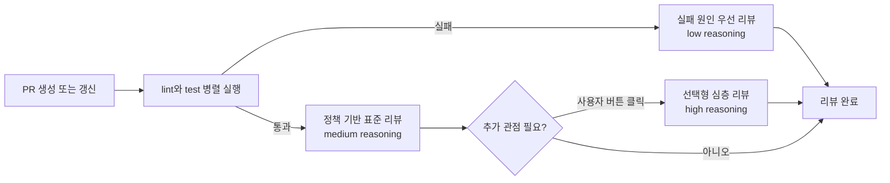
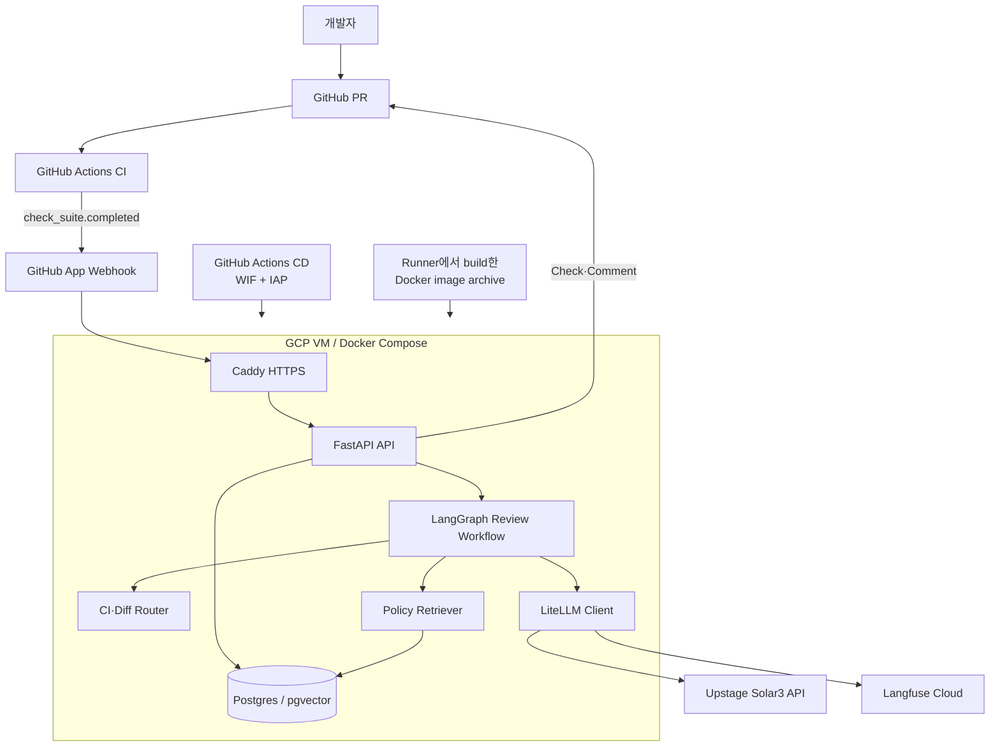
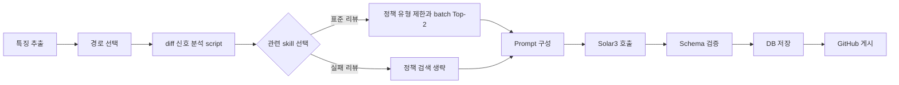

# AI Code Review Agent 프로젝트 발표 자료

본문 10장 기준이다. 각 장의 **화면 구성**은 슬라이드에 넣을 내용이고, **발표 포인트**는
발표자 노트로 사용한다.

---

## 1. Title / Intro

### 화면 구성

**AI Code Review Agent**

> CI 결과와 저장소 정책에 맞춰 리뷰 깊이를 조절하는 GitHub App

- 발표자: `[이름 / 팀명]`
- 핵심 기술: GitHub App · LangGraph · LiteLLM · Upstage Solar3 · RAG

### 시각 자료

실제 PR의 `AI Code Review` Check와 한글 리뷰 댓글을 배경 화면으로 사용한다. 토큰, 저장소의
민감한 이름과 사용자 정보는 가린다.

### 발표 포인트

이 프로젝트는 코드를 생성하는 에이전트가 아니라, PR의 CI 결과와 팀 정책을 근거로 리뷰
우선순위와 추론 강도를 선택하는 설치형 코드 리뷰 서비스다.

---

## 2. Problem & Background

### 화면 구성

**모든 PR을 같은 방식으로 리뷰하면 느리고, 비싸고, 팀 기준을 놓친다**

| 기존 과정의 문제 | 발생하는 결과 |
| --- | --- |
| CI 실패와 설계 문제를 같은 깊이로 분석 | 명백한 오류에도 불필요한 추론 비용 발생 |
| 리뷰어마다 기준과 표현이 다름 | 저장소 정책 적용의 일관성 저하 |
| 큰 diff 전체를 모델에 전달 | 응답 지연, 토큰 증가, 핵심 finding 희석 |
| 성공 여부만 측정 | 리뷰가 실제 결함을 찾았는지 설명하기 어려움 |

### 발표 포인트

목표는 사람의 승인을 대체하는 것이 아니다. 반복 검사를 빠르게 처리하고, 사람은 아키텍처와
제품 판단에 집중하도록 리뷰의 첫 단계를 표준화하는 것이다.

---

## 3. Solution

### 화면 구성

**CI 인지형 라우팅 + 정책 근거 리뷰 + 선택적 심층 리뷰**

1. GitHub App이 PR과 CI 완료 이벤트를 수신한다.
2. lint/test 결과와 diff 특성을 이용해 자동 리뷰 경로를 선택한다.
3. 통과 PR은 관련 내부 정책을 검색해 근거와 함께 리뷰한다.
4. 더 넓은 관점이 필요할 때만 사용자가 심층 리뷰를 실행한다.
5. 결과와 토큰, latency, route를 저장해 품질과 비용을 관측한다.

### 핵심 차별점

- 하나의 `solar-pro3` 모델을 사용하고 작업 난도에 따라 `reasoning_effort`를 조절
- 정책 검색 결과를 prompt와 finding의 출처로 연결
- 모든 PR에 고비용 추론을 강제하지 않고 GitHub Check 버튼으로 심층 리뷰 선택

### 발표 포인트

low, medium, high는 서로 다른 모델 이름이 아니라 같은 모델의 추론 강도다. 사용자 화면에서는
`실패 원인 우선`, `정책 기반 표준`, `선택형 심층`처럼 목적 중심으로 표현한다.

---

## 4. Features & Routing

### 화면 구성



| 경로 | 실행 조건 | 집중하는 내용 |
| --- | --- | --- |
| 실패 원인 우선 | syntax, lint, test 실패 | 실패 근거, 원인 파일, 최소 수정 순서 |
| 정책 기반 표준 | CI 실패 없음 | API, 테스트, 보안, 성능 등 관련 정책 위반 |
| 선택형 심층 | 사용자가 Check action 클릭 | 시간·공간 복잡도, 간소화, 구조, 운영 영향 |

### 발표 포인트

고위험 파일이나 큰 diff는 표준 리뷰에서 심층 검토를 권고하지만, 고비용 심층 리뷰는 자동으로
실행하지 않는다. 비용을 줄이는 동시에 사용자가 필요할 때 두 번째 시각을 확보한다.

---

## 5. System Architecture

### 화면 구성



### 처리 순서

`CI 완료 → GitHub 데이터 수집 → pending Check → LangGraph → 저장 → 댓글/Check 완료`

### 발표 포인트

배포는 소스 복사가 아니라 Actions runner에서 build한 Docker image archive를 사용한다.
GitHub Actions는 WIF로 GCP 권한을 얻고 IAP를 통해 VM에 전송한다. Caddy가 HTTPS를 종료하며
애플리케이션과 DB는 Compose로 관리한다.

---

## 6. LangGraph & Policy Harness

### 화면 구성



**현재 정책 범위**

- API 계약, GitHub 리뷰 흐름, 테스트와 라우팅
- 보안과 개인정보, 성능과 유지보수성, 관측성과 신뢰성
- Markdown heading 단위 chunk, Postgres 저장, batch별 관련도 상위 2개 사용
- API·보안·테스트·신뢰성·성능 skill 중 관련 절차만 prompt에 주입

**정확한 현재 상태**

- 검색은 token overlap 기반 lexical retrieval
- `embedding` 컬럼은 있으나 vector/hybrid 검색은 후속 과제
- 현재는 서비스 공통 정책이며 설치 저장소 정책 자동 수집은 후속 과제

### 발표 포인트

하네스는 모든 정책을 매번 넣는 대신 신뢰된 script가 diff 신호를 만들고 필요한 skill과 정책
유형을 선택한다. 11개 fixture에서는 필수 skill·지식 카드·정책 유형 Recall 1.0, 지식 카드와 정책
유형 Precision 1.0을 기록했고 정책 context를 기존 top-3 대비 38.43% 줄였다. 이는 선택 단계 수치이며
최종 리뷰 정확도는 아니다.

---

## 7. Technology Stack

### 화면 구성

| 영역 | 기술 | 선정 이유 |
| --- | --- | --- |
| GitHub 연동 | GitHub App, Webhook, Checks API | 조직 단위 설치, 최소 권한, PR UI 안에서 상호작용 |
| API | FastAPI | 비동기 webhook 처리, 명확한 schema, 빠른 API 개발 |
| Workflow | LangGraph | 라우팅과 노드를 명시하고 실행 단계를 확장·관측하기 쉬움 |
| LLM Gateway | LiteLLM Python SDK | OpenAI 호환 호출, provider 추상화, callback 기반 관측 |
| Model | Upstage Solar3 | 한국어 리뷰와 reasoning effort 지원 |
| RAG/Storage | PostgreSQL, pgvector | 리뷰 이력과 정책을 함께 영속화하고 vector 전환 가능 |
| Observability | Langfuse Cloud | prompt, 응답, token, latency, route trace 확인 |
| Runtime/CD | Docker Compose, image archive, GCP VM, WIF/IAP | 재현 가능한 이미지 배포와 장기 키 없는 GCP 인증 |
| Edge | Caddy | HTTPS 인증서 발급과 reverse proxy 자동화 |

### 발표 포인트

LiteLLM은 별도 대시보드 서버가 아니라 API 컨테이너 안의 SDK다. 실행 관측은 Langfuse,
업무 결과와 정책은 Postgres, 최종 사용자 경험은 GitHub PR 화면에서 확인한다.

---

## 8. Demonstration

### 화면 구성

```text
Pull Request
├─ CI / ci                         ✓ 통과
└─ AI Code Review                  ✓ 완료
   ├─ 실행 경로: 정책 기반 표준 리뷰
   ├─ 변경 요약
   ├─ 변경 파일별 요약 표
   ├─ 검증된 파일·라인별 리뷰
   ├─ 근거 정책: security-and-privacy.md
   └─ [심층 리뷰 실행]

사용자 버튼 클릭 후
└─ 선택형 심층 리뷰
   ├─ 시간/공간 복잡도
   ├─ 동작 보존형 코드 간소화
   └─ 구조·보안·운영의 두 번째 관점
```

### 3분 시연 순서

1. CI 실패 PR에서 `실패 원인 우선 리뷰` 확인
2. CI 통과 PR에서 정책 출처가 포함된 표준 리뷰 확인
3. `심층 리뷰 실행` 버튼으로 선택형 리뷰 요청
4. Langfuse에서 실제 prompt, Solar3 응답, token, latency, route 확인
5. GitHub Actions에서 배포 성공과 실행 중인 서비스 확인

### 발표 포인트

라이브 시연에서는 CI 대기 시간을 피하기 위해 미리 준비한 PR 두 개를 사용한다. 새 commit은
동작 증명용으로만 최소화하고, 네트워크 장애에 대비해 같은 순서의 캡처를 준비한다.

---

## 9. Key Results & KPI

### 화면 구성

**검증 완료**

- GitHub App webhook → CI 이후 자동 리뷰 → Check/댓글 게시 동작 확인
- 동일 모델의 추론 강도 라우팅과 사용자 선택형 심층 리뷰 동작 확인
- 실제 Solar3 API 호출을 Postgres와 Langfuse trace에서 확인
- GCP VM 이미지 기반 자동 배포와 Caddy HTTPS 동작 확인
- 모델 finding 검증 후 GitHub diff inline review 게시 구조 반영
- 로컬 단위 테스트 50개와 Ruff 통과
- 실제 Solar3 sample에서 skill·지식 카드·정책 선택과 한국어 구조화 결과 확인
- 정책 하네스 fixture 11개를 CI에서 회귀 검증

**정량 평가 기준**

| 지표 | 목표 | 현재 값 |
| --- | ---: | ---: |
| 자동 리뷰 완료율 | ≥ 98% | baseline pending |
| Small PR agent latency p95 | ≤ 75초 | baseline pending |
| Medium PR agent latency p95 | ≤ 150초 | baseline pending |
| Routing macro F1 | ≥ 0.95 | baseline pending |
| 정책 Retrieval Recall@2 | ≥ 0.85 | baseline pending |
| 하네스 필수 skill / 지식 카드 / 정책 유형 Recall | 1.00 / 1.00 / 1.00 | 1.00 / 1.00 / 1.00 (N=11) |
| 지식 카드 / 정책 유형 Precision | 추세 관리 | 1.00 / 1.00 (N=11) |
| 기존 top-3 대비 정책 context 감소 | 추세 관리 | 38.43% (N=11) |
| Finding Precision@5 / Recall@5 | ≥ 0.70 / ≥ 0.60 | baseline pending |
| 승인 snapshot severe false-positive | ≤ 0.10 | baseline pending |
| 전부 심층 리뷰 대비 비용 절감 | ≥ 25% | baseline pending |

### 품질 증명 데이터

- 내부 통제 fixture 36개: CI 실패, 정책 위반, 복잡도, 정상 변경
- 오픈소스 75 snapshot 목표: maintainer inline finding, 후속 수정과 승인 상태 정상 PR
- 후보: CPython, Django, Kubernetes, Rust
- `openai/codex` inline comment 1,000건을 표본 분석하고 공개 PR 수집 CLI 구현
- SWE-bench Verified 20건은 기능 결함 탐지의 보조 평가로 분리

### 발표 포인트

PR 생성부터 CI 완료까지는 `ci_wait_ms`, CI 완료 webhook부터 리뷰 게시까지는 agent latency로
분리한다. 평균이나 “항상 5분 이내” 대신 diff 구간별 p50/p95를 사용한다.

---

## 10. Future Plan & Impact

### 화면 구성

**단기 고도화**

1. 단계별 latency를 영속화하고 route·diff 구간별 p50/p95 자동 집계
2. 36개 내부 fixture와 오픈소스 snapshot으로 품질 baseline 측정
3. GitHub/Upstage timeout, rate limit 재시도와 중복 실행 방지
4. repository별 정책 수집, source SHA 관리, 하네스 fixture 확장과 hybrid retrieval 비교
5. 큰 diff에서 위험 파일과 실행 코드 우선 context selection

**기대 효과**

| 사용자 관점 | 운영·비즈니스 관점 |
| --- | --- |
| 반복 오류의 빠른 피드백 | PR당 token과 비용 추적 |
| 팀 정책의 일관된 적용 | 리뷰 완료율과 장애 원인 계량화 |
| 심층 검토가 필요한 PR에 집중 | 저장소별 정책을 서비스 자산으로 축적 |
| GitHub를 벗어나지 않는 사용 경험 | 모델 교체 가능한 LLM gateway 구조 |

> 더 많은 문장을 생성하는 리뷰어가 아니라, 필요한 순간에 근거 있는 리뷰를 제공하는 에이전트

### 발표 포인트

완성의 기준은 “LLM이 댓글을 달았다”가 아니다. 결함 탐지 정확도, 정책 근거의 유효성,
latency와 비용을 반복 측정하고 개선할 수 있는 LLMOps 시스템으로 발전시키는 것이 목표다.
