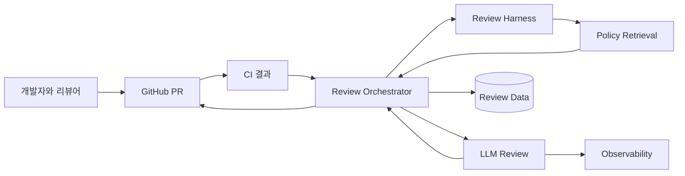

# AI Code Review Agent 설명서

> 이 문서는 개발자가 아닌 사람에게도 프로젝트를 일관되게 설명하기 위한 추상화 문서다.
> 구현의 최신 상태는 `프로젝트 현황.md`를 기준으로 한다.

- 마지막 갱신일: 2026-07-13
- 대상 독자: 발표 청중, 팀원, 평가자, 협업 개발자, 잠재 사용자

## 1. 설명 길이별 요약

### 한 문장

AI Code Review Agent는 PR의 CI 결과와 팀 정책에 따라 리뷰 깊이를 조절하고, 필요한 경우에만
심층 분석을 제공하는 GitHub App이다.

서비스 제공 단계에서는 운영 Organization이 하나의 공개 GitHub App을 관리하고, 사용자는 별도
App을 만들지 않고 자신의 개인 계정이나 Organization 저장소에 설치한다.

### 30초 설명

기존 AI 리뷰는 모든 변경을 비슷한 방식으로 분석해 단순 CI 실패에도 시간과 비용을 많이 쓸 수
있고, 팀마다 다른 정책을 놓치기 쉽다. 이 서비스는 CI 실패 여부와 diff를 먼저 보고, 실패 PR은
원인 해결 중심으로 빠르게 리뷰하며 통과 PR은 diff 신호로 필요한 검토 skill과 정책만 골라
근거 기반 리뷰를 작성한다.
아키텍처나 복잡도 검토는 사용자가 버튼을 눌렀을 때만 별도의 심층 리뷰로 실행한다.

### 2분 설명

개발자가 PR을 올리면 먼저 기존 GitHub Actions CI가 동작한다. 서비스는 GitHub App webhook을
통해 CI 완료 사실을 받고, 어떤 check가 실패했는지와 어떤 파일이 바뀌었는지를 수집한다.
LangGraph workflow가 이를 분석해 실패 원인 우선 또는 정책 기반 표준 리뷰를 선택한다.

표준 리뷰에서는 신뢰된 분석 script가 API, 테스트, 보안, 성능 같은 신호를 만들고 관련
`SKILL.md`, 구체적인 증거·오탐 방지 지식 카드와 내부 정책 chunk만 Solar3 prompt에 넣는다.
자동 표준 리뷰는 범용 추측보다 precision을 우선해 구체적인 카드가 없는 batch에서는 finding을
만들지 않는다.
모델 finding은 파일, diff line, 정책 출처와 선택 지식 카드 ID를 검증한 뒤 GitHub inline review와 PR 요약으로
보인다. PR 요약은 `변경 요약`, `변경 파일별 변경 요약`, `리뷰` 세 구역으로 제공한다. 사용자가
더 넓은 검토가 필요하다고 판단하면 Check 버튼을 눌러 시간·공간 복잡도,
간소화, 구조와 운영 영향을 보는 심층 리뷰를 추가한다.

큰 PR은 하나의 긴 prompt로 처리하지 않고 파일과 patch 크기를 기준으로 여러 묶음으로 나눈다.
묶음 리뷰를 제한된 병렬 호출로 실행한 뒤 중복과 근거를 검증해 하나의 GitHub 리뷰로 합친다.

모델 호출은 LiteLLM으로 추상화하고 Langfuse에서 prompt, 응답, token과 latency를 관측한다.
리뷰 결과와 정책은 Postgres에 저장한다. 핵심은 LLM 댓글 자체가 아니라 어떤 조건에서 어떤
리뷰를 선택했고, 그 결과가 얼마나 빠르고 정확하며 비용 효율적인지 측정 가능한 구조다.

## 2. 서비스의 본질

이 프로젝트를 “코드를 읽고 댓글을 다는 챗봇”으로 설명하면 핵심이 빠진다. 서비스의 본질은
다음 세 가지다.

1. **판단**: CI와 diff를 보고 지금 필요한 리뷰 유형을 선택한다.
2. **근거**: 변경에 맞는 skill과 팀 정책만 선택하고 finding의 출처로 연결한다.
3. **운영**: 실행 시간, token, 오류와 결과를 추적해 개선 가능하게 만든다.

따라서 주요 산출물은 리뷰 문장뿐 아니라 route, 정책 근거, 구조화된 finding, 사용량과 trace다.

## 3. 사용자와 역할

| 사용자 | 원하는 것 | 서비스가 제공하는 것 |
| --- | --- | --- |
| PR 작성자 | 빠르고 구체적인 수정 피드백 | CI 실패 원인, 파일·line finding, 수정 제안 |
| 리뷰어 | 반복 검사 감소와 중요한 판단 집중 | 정책 기반 1차 검토와 선택형 심층 분석 |
| 팀 리드 | 팀 규칙의 일관된 적용 | 공통 정책 index와 정책 출처 표시 |
| 운영자 | 실패 원인과 비용 확인 | Langfuse trace, DB 이력, container log |
| 조직 관리자 | 안전한 저장소 설치와 권한 통제 | GitHub App installation과 최소 권한 token |

### 공개 서비스의 목표 온보딩

1. 사용자가 서비스의 GitHub App 설치 링크를 연다.
2. 개인 계정 또는 Organization과 App이 접근할 저장소를 선택한다.
3. 대상 저장소 기본 브랜치에 `.github/ai-review-policy.md`를 추가한다.
4. 저장소별 CI 대기 방식과 리뷰 옵션을 선택한다.
5. 이후 PR부터 서비스가 해당 installation과 repository 범위의 정책을 읽어 리뷰에 반영한다.
6. App을 제거하거나 저장소 접근을 해제하면 해당 범위의 처리와 데이터 보존 정책이 적용된다.

정책은 PR head가 아니라 base/default branch에서 읽는다. 리뷰 대상 PR이 정책 자체를 함께
변경하더라도 승인 전 정책을 기준으로 검증하기 위해서다. 현재 배포본은 이 공개 온보딩과 저장소
정책 수집을 아직 지원하지 않으며, 운영 Organization 내부 설치와 공통 정책 리뷰까지만 검증됐다.

## 4. 핵심 개념 모델

```text
Repository
  └─ Pull Request
      ├─ Changed Files / Diff
      ├─ CI Check Results
      └─ Review Run
          ├─ Route
          ├─ Review Harness / Skills
          ├─ Knowledge Cards
          ├─ Retrieved Policies
          ├─ Model Call Usage
          ├─ Findings
          └─ GitHub Check / Comment
```

- **Review Run**: 하나의 PR head SHA와 review mode에 대한 리뷰 실행
- **Route**: 실패 원인 우선, 정책 기반 표준, 선택형 심층 중 하나
- **Review Harness**: 신뢰된 script, 선택 규칙, skill, 정책을 연결하는 실행 장치
- **Skill**: API·보안·성능 등 특정 관점에서 근거를 찾는 짧은 검토 절차
- **Knowledge Card**: skill 안에서 검사할 조건, 필요한 증거, 오탐 방지 기준을 담은 작은 지식 단위
- **Policy Chunk**: 검색과 인용을 위해 정책 문서를 작은 단위로 나눈 것
- **Finding**: category, file, line, message, suggestion, policy source와 검토 카드 ID를 가진 지적
- **Check**: GitHub PR에 리뷰 진행과 성공·실패를 표시하는 사용자 인터페이스
- **Trace**: prompt부터 모델 응답과 latency까지 연결한 관측 기록

## 5. 세 가지 리뷰 경험

### 실패 원인 우선 리뷰

문법, lint, test 중 하나라도 실패했을 때 실행한다. 이미 확인 가능한 실패를 먼저 해결하도록
원인과 수정 순서를 짧게 제시한다. 정책 검색을 생략하고 낮은 추론 강도를 사용한다.

### 정책 기반 표준 리뷰

실패 check가 없을 때 자동으로 실행한다. diff 신호로 관련 skill과 공통 정책 유형을 고른 뒤
batch마다 최대 2개 정책 chunk를 사용해 테스트, API 계약, 보안 등의 문제를 검토한다.
일반적인 PR의 기본 리뷰 경험이다.

### 선택형 심층 리뷰

사용자가 요청할 때만 실행한다. 표준 리뷰를 길게 반복하는 것이 아니라 시간·공간 복잡도,
동작을 보존하는 코드 간소화, 책임 경계, 보안과 운영 영향을 독립적인 시각에서 분석한다.
diff만으로 입증할 수 없는 추측은 finding으로 만들지 않는 것이 목표다.

## 6. 시스템을 추상화한 구조



외부에서 보면 GitHub가 사용자 인터페이스, Review Orchestrator가 판단 엔진, Review Harness가
검토 절차와 정책 선택기, LLM이 분석 엔진, Postgres와 Langfuse가 기억과 관측 역할을 맡는다.

## 7. 왜 이 기술을 사용하는가

| 기술 | 추상화된 역할 | 선택 이유 |
| --- | --- | --- |
| GitHub App | 저장소와 서비스의 신뢰 경계 | 조직 설치, 저장소별 권한, 짧은 installation token |
| GitHub Actions | 기존 품질 신호 | lint/test 결과를 리뷰 판단에 재사용 |
| LangGraph | 판단 절차 | node와 조건부 경로로 리뷰 과정을 명시 |
| LiteLLM | 모델 adapter | 호출 인터페이스와 관측 연동을 모델에서 분리 |
| Solar3 | 분석 엔진 | 한국어 결과와 추론 강도 조절 |
| RAG | 팀 지식 연결 | 일반 모델 답변을 프로젝트 정책에 grounding |
| Policy Harness | context 선택 | script 신호로 필요한 skill·지식 카드·정책만 prompt에 전달 |
| Postgres | 영속 상태 | 리뷰 이력과 정책 index 저장 |
| Langfuse | LLMOps 관측 | prompt, 응답, token, latency, metadata 추적 |
| Docker/GCP VM | 실행 환경 | 동일 image의 재현 가능한 서버 실행 |

## 8. 다른 AI 코드 리뷰와 구분해 설명하는 방법

비교할 때 특정 제품을 과장해서 낮추지 않고 설계 선택의 차이로 설명한다.

| 일반적인 단일 경로 리뷰 | 이 프로젝트의 방향 |
| --- | --- |
| PR마다 동일한 분석 깊이 | CI 결과와 사용자 선택으로 깊이 조절 |
| 범용 기준 중심 | 선택된 skill과 팀 정책을 근거로 추가 |
| 최종 댓글 중심 | route, 정책, token, latency, trace까지 관리 |
| 모델 응답 성공 여부 중심 | 정확도, false positive, 완료율과 비용을 함께 평가 |

현재 저장소별 정책 자동 수집이나 vector 검색까지 완성된 것은 아니므로, “모든 저장소를 자동으로
학습한다” 또는 “semantic search가 완성됐다”고 설명하지 않는다.

## 9. 품질을 증명하는 방식

리뷰가 자연스럽게 보인다는 주관적 평가만 사용하지 않는다.

- **라우팅**: 실패/표준/심층 fixture의 macro F1
- **정책 검색**: Recall@2, MRR@2, unrelated retrieval rate
- **하네스 선택**: 필수 skill·정책 유형 Recall과 주입 context 감소율
- **정책 근거**: finding의 citation과 card ID가 실제 선택 집합에 속하고 주장을 지지하는 비율
- **결함 탐지**: Finding Precision@5와 Recall@5
- **과잉 지적**: 승인된 정상 snapshot의 severe false-positive rate
- **수정 민감도**: 수정 전 finding이 수정 후 사라지는 비율
- **성능**: diff 크기별 agent latency p50/p95
- **경제성**: 모든 PR을 high로 처리하는 기준선 대비 비용 절감률

오픈소스 평가는 단순히 merged PR을 정답으로 보지 않는다. maintainer가
`CHANGES_REQUESTED`를 남긴 시점의 commit과 수정 후 `APPROVED` 또는 merge된 commit을 한 쌍으로
사용해 실제 지적과 수정 전후의 차이를 평가한다.

## 10. 발표와 설명에서 사용할 표현

### 사용해도 되는 표현

- “CI 결과에 따라 자동 리뷰 목적과 추론 강도를 조절한다.”
- “신뢰된 script가 관련 skill을 고르고 batch마다 정책 chunk를 최대 2개만 사용한다.”
- “선택된 지식 카드는 필요한 증거와 오탐 방지 조건을 실제 모델 prompt에 전달한다.”
- “모델 finding은 선택된 지식 카드 ID를 기록하며 누락·임의 ID와 카드 상한 초과 중요도를 사후 검증한다.”
- “공식 출처 23개를 26개 증거·오탐 지식 카드로 정제하고 모든 카드의 출처 연결을 검증한다.”
- “11개 선택 fixture에서 skill·카드·정책 유형 Recall 1.0, 기존 top-3 대비 정책 context 38.43% 감소를 확인했다.”
- “동일 PR 단회 실험에서 batch quota와 precision 우선 카드 선택 후 completion 56.6%, LLM 시간 49.3% 감소를 관측했다.”
- “심층 리뷰는 사용자가 GitHub Check에서 선택적으로 요청한다.”
- “실제 Solar3 호출과 token, latency는 Langfuse와 DB에서 확인했다.”
- “목표 KPI는 정의됐고 실측 baseline은 별도로 수집 중이다.”

### 아직 사용하면 안 되는 표현

- “벡터 검색으로 저장소 정책을 완전히 이해한다.”
- “모든 리뷰가 5분 안에 100% 성공한다.”
- “사람의 코드 리뷰를 대체한다.”
- “무중단 배포와 자동 rollback을 지원한다.”
- “모든 설치 저장소의 정책을 자동 학습한다.”
- “하네스만으로 실제 finding 품질 향상이 검증됐다.”
- “단일 PR 실측 감소율이 전체 PR의 평균 성능이다.”

## 11. 기대 효과

### 개발자와 리뷰어

- 단순 실패는 빠르게 고치고, 사람은 설계와 제품 판단에 집중한다.
- 팀 정책을 기억하거나 매번 직접 찾는 부담을 줄인다.
- GitHub를 벗어나지 않고 기본 리뷰와 심층 리뷰를 선택한다.

### 조직과 운영

- 리뷰 기준을 문서화된 정책 자산으로 축적한다.
- route별 품질, latency와 token을 비교해 모델 사용을 최적화한다.
- 리뷰 실패를 외부 API, 검색, 모델, 게시 단계로 나누어 진단한다.

## 12. 현재와 목표의 경계

| 현재 동작 | 다음 목표 |
| --- | --- |
| 공통 정책 하네스와 batch별 lexical top-2 | 저장소별 정책과 hybrid retrieval |
| 운영 Organization 내부 설치 | 외부 계정 공개 설치와 installation별 데이터 격리 |
| FastAPI background task | durable queue와 checkpoint/retry |
| 단일 VM Compose 배포 | rollback과 무중단 전환 |
| Langfuse 개별 trace | route·diff별 자동 SLO dashboard |
| 하네스 선택 fixture 11개 | 36개 fixture와 오픈소스 finding A/B baseline |

최신 구현 상태, 배포 방식과 구체적인 남은 작업은 `docs/프로젝트 현황.md`만 갱신해 관리한다.
